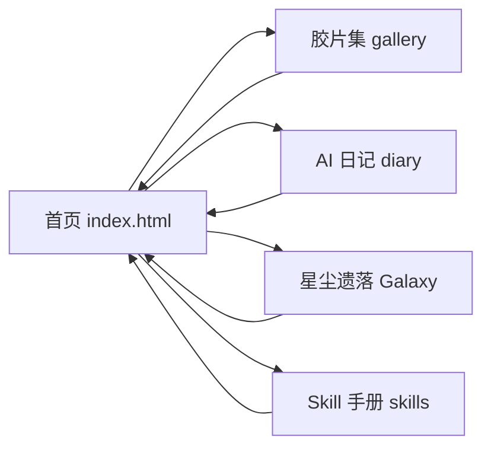
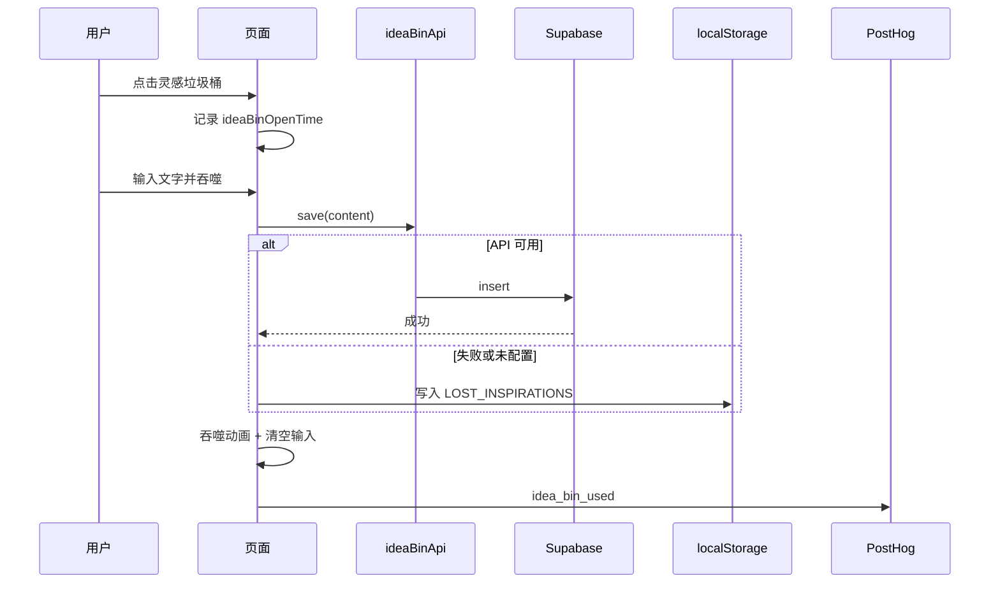

# Lin's lab 产品需求文档（PRD）

**版本**：基于当前线上站点的产品描述  
**产品名称**：Lin's lab（刘锦麟个人站）  
**基线**：Vercel 部署版本，域名 `gatsby-website-nine.vercel.app`

---

## 一、产品概述

### 1.1 产品定位

Lin's lab 是**个人品牌与实验入口站**：展示项目入口（胶片集、AI 日记、星尘遗落、Skill 手册），并提供全站可用的「灵感垃圾桶」用于随时记录、沉淀灵感，并在星尘遗落页以可视化方式回顾。

### 1.2 目标用户

- **主用户**：站点主本人（刘锦麟），用于日常记录、作品展示与灵感管理。
- **访客**：通过链接或搜索进入的读者，浏览日记、胶片、星尘与 Skill 手册。

### 1.3 核心价值

- **统一入口**：一个首页聚合所有子项目与实验。
- **灵感不丢**：多页可用的灵感垃圾桶，支持 Supabase 持久化与星尘可视化。
- **轻量可维护**：静态站、无后端服务，构建即部署，便于长期迭代。

---

## 二、产品结构

### 2.1 站点地图



### 2.2 页面清单

| 路径 | 名称 | 说明 |
|------|------|------|
| `/` | 首页 | Lin's lab 标题 + 四个入口卡片 + 灵感垃圾桶入口 |
| `/gallery.html` | 胶片集 | 摄影作品瀑布流 + 灯箱 |
| `/diary.html` | AI 日记 | 手写 HTML 日记列表 + 一言格言 + 灵感垃圾桶 |
| `/Galaxy.html` | 星尘遗落 | 灵感星尘 Canvas 可视化 + 搜索/查看/删除 |
| `/skills.html` | Skill 手册 | Cursor Agent Skills 列表与调用路径 |

### 2.3 全局能力（多页共有）

- **主题切换**：明/暗模式，持久化在 `localStorage.theme`。
- **灵感垃圾桶**：右下角入口，任意页面（含日记）可打开并「吞噬」灵感；数据 Supabase 优先，失败回退 localStorage。
- **分析埋点**：GA4 页面浏览；PostHog 行为事件（灵感垃圾桶使用、胶片点击等）。

---

## 三、用户故事与验收标准

### 3.1 首页（Lin's lab）

**故事**：作为访客，我打开首页即可看到站点名称、副标题和四个入口卡片，并能通过右下角入口使用灵感垃圾桶。

**验收标准**：

- 页面标题为「Lin's lab」，副标题为「项目与实验入口」。
- 四个入口卡片：胶片集、AI 日记、星尘遗落、Skill 手册；点击分别进入对应页面。
- 右下角有灵感垃圾桶触发按钮；点击后出现浮层，可输入文字并「吞噬」或按 Enter 提交。
- 支持明/暗主题切换，刷新后保持用户选择。

**首页布局示意（ASCII）**：

```
+--------------------------------------------------+
|  [主题切换]                                       |
|  +--------------------------------------------+  |
|  |  Lin's lab                                 |  |
|  |  项目与实验入口                              |  |
|  +--------------------------------------------+  |
|  [胶片集]    [AI 日记]    [星尘遗落]    [Skill]  |
|  个人摄影    基于AI的     灵感碎片与    Cursor   |
|  集展示      日记与记录   星尘可视化    Skills  |
+--------------------------------------------------+
                                    [灵感垃圾桶] <- 右下角
```

---

### 3.2 胶片集

**故事**：作为访客，我可以在胶片集页浏览摄影作品，点击某张图片后在灯箱中放大查看，并可通过返回回到首页。

**验收标准**：

- 使用 `GALLERY_PHOTOS`（1.jpg～10.jpg）在 `/photo` 下渲染瀑布流；图片懒加载。
- 点击图片后灯箱打开，图片从原位置动画飞向中心放大；可点击遮罩或关闭按钮或按 Esc 关闭。
- 有返回首页链接；点击图片时向 PostHog 发送 `image_clicked`（image_id、page）。
- 本页同样提供灵感垃圾桶与主题切换。

**约束**：图片文件名必须为小写 `1.jpg`…`10.jpg`，否则部署环境可能 404。

---

### 3.3 AI 日记

**故事**：作为访客，我可以在 AI 日记页按时间正序阅读日记（最早在上），并可展开/收起单条；页顶展示每日一言格言；本页也可使用灵感垃圾桶。

**验收标准**：

- 日记列表时间正序：最早日期在最上方，越往下越晚。
- 每条日记包含日期、可点击标题（展开/收起）、正文；新增日记时在 `diary-section` **最下方**追加，禁止插在顶部。
- 页顶格言来自一言 API（按北京时间的「天」缓存，每天 8 点后更新）；加载失败时显示「今日一言加载失败」。
- 灵感垃圾桶在本页通过内联脚本单独实现（与首页逻辑一致：Supabase 优先，失败回退 localStorage），吞噬时上报 PostHog `idea_bin_used`。
- 有返回首页链接与主题切换。

**日记条目结构示意**：

```
+------------------------------------------+
| 2025-02-20   [Skill 库与新站        ]   |  <- 点击展开/收起
+------------------------------------------+
| 今天在 skill 库里查了不少 skill...       |
| 另外做了一个新网站，先记一笔...          |
+------------------------------------------+
```

---

### 3.4 星尘遗落（Galaxy）

**故事**：作为用户，我可以在星尘遗落页看到已「吞噬」的灵感以星尘粒子的形式分布在画布上；可搜索关键词高亮匹配的星、点击某颗星查看内容或删除，并可通过召唤浮层输入关键词筛选。

**验收标准**：

- 数据来源：优先 `ideaBinApi.load()`（Supabase），失败则使用 `localStorage.LOST_INSPIRATIONS`；每条需含 `content`、`timestamp`、`id`（x/y 可随机）。
- Canvas 上渲染背景星与灵感星尘；星尘有呼吸动画与鼠标接近时亮度变化。
- 支持搜索浮层：输入关键词后 Enter，画布上匹配该关键词的星高亮/展开文案。
- 点击某颗星可弹出卡片展示内容与时间，并提供删除按钮；删除后调用 `ideaBinApi.delete(id)` 或从本地列表移除并刷新画布。
- 有返回首页链接；本页为独立深色太空风格，无全局导航栏。

---

### 3.5 Skill 手册

**故事**：作为访客，我想快速查看 Lin's lab 使用的 Cursor Agent Skills 列表及调用方式，便于复制或参考。

**验收标准**：

- 页面展示分组后的 Skill 列表（如思维/决策、写作、设计等），每项包含名称、简短描述、触发场景与调用路径（可复制）。
- 有返回 Lin's lab 首页的链接。
- 样式独立（深色背景、卡片网格），与其余页面风格区分即可。

---

### 3.6 灵感垃圾桶（跨页功能）

**故事**：作为用户，我在任意已接入的页面都可以打开灵感垃圾桶，输入一段想法后「吞噬」或按 Enter 保存，并可在星尘遗落页看到这些灵感化为星尘。

**验收标准**：

- 打开时记录 `ideaBinOpenTime`；吞噬时上报 PostHog `idea_bin_used`（page、timestamp、duration_seconds）。
- 保存逻辑：若 `window.ideaBinApi` 存在则调用 `api.save(content)`，成功则仅做吞噬动画；失败或未配置则回退到 `localStorage.LOST_INSPIRATIONS`，并同样执行吞噬动画。
- 吞噬后有简短视觉反馈（文案飞入 + 星爆动画）；Esc 关闭浮层。
- 日记页的灵感垃圾桶使用内联脚本单独实现，与 `script.js` 中逻辑一致（因 `script.js` 对 `page-diary` 不执行 initIdeaBin）。

**数据流示意**：



---

## 四、数据与集成

### 4.1 Supabase

- **用途**：灵感持久化（表 `inspirations`）。
- **表结构**：`id` (uuid)、`content` (text)、`user_id` (uuid, nullable)、`created_at`。
- **策略**：RLS 开放匿名 insert/select；仅使用 Publishable (anon) key，禁止在前端使用 service_role。
- **配置**：本地 `supabase-config.js`（gitignore）；线上由 Vercel 环境变量 `SUPABASE_URL`、`SUPABASE_ANON_KEY` 在构建时经 `scripts/generate-supabase-config.js` 生成 `public/supabase-config.js`。未设置时跳过生成，前端 `ideaBinApi === null`，自动回退 localStorage。

### 4.2 分析（GA4 + PostHog）

- **GA4**：页面浏览（page_view），用于流量概览。
- **PostHog**：行为事件
  - `idea_bin_used`：page、timestamp、duration_seconds
  - `image_clicked`：image_id、page
- **配置**：`public/analytics-config.js` 由 `scripts/generate-analytics-config.js` 根据 `GA_MEASUREMENT_ID`、`POSTHOG_KEY`、`POSTHOG_HOST` 生成；PostHog 必须使用官方 stub 内联 + `posthog.init`，保证 `window.posthog` 立即可用。

### 4.3 本地回退

- 灵感数据：`localStorage.LOST_INSPIRATIONS`，JSON 数组，每项含 `content`、`timestamp`、`id`、`x`、`y`。
- 主题：`localStorage.theme`，取值 `"dark"` | `"light"`。
- 日记格言：`localStorage.diary_motto`，按北京时间的日期缓存一言 API 结果。

---

## 五、技术约束与构建

### 5.1 技术栈

- 静态多页站；**非** Gatsby。Vite 7 构建，产出目录 `dist/`。
- 前端：原生 HTML + CSS + JS（无框架）；`public/` 在构建时拷贝到 `dist/` 根。
- 入口 HTML：`index.html`、`gallery.html`、`diary.html`、`Galaxy.html`、`skills.html`。
- 全局资源：根目录 `styles.css`、`script.js`；构建前 `copy-styles.js` 将 `styles.css` 同步到 `public/styles.css`。

### 5.2 构建与部署

- **构建命令**（顺序固定）：  
  `node scripts/copy-styles.js && node scripts/generate-supabase-config.js && node scripts/generate-analytics-config.js && vite build`
- **部署**：GitHub main 分支推送触发 Vercel 自动构建与发布；生产域名 `gatsby-website-nine.vercel.app`。
- 修改 Vercel 环境变量后必须 Redeploy 才能生效。

### 5.3 关键约束（避坑）

- 胶片集图片文件名统一小写 `.jpg`；仅改扩展名时需用两步 `git mv` 保证 Git 记录小写。
- 禁止在前端使用 Supabase service_role/Secret key。
- 构建脚本只读 `SUPABASE_URL`、`SUPABASE_ANON_KEY`（非 `VITE_*`）。

---

## 六、非功能性需求

### 6.1 SEO 与分享

- 各页具备：description、keywords、robots、canonical、og:type/url/title/description/image、twitter:card/title/description。
- 基础 URL：`https://gatsby-website-nine.vercel.app`；若绑定自定义域名需全局替换。

### 6.2 无障碍与体验

- 主题切换按钮带 `aria-label`；灵感垃圾桶触发按钮带 `aria-label` 与 `title`。
- 灯箱、浮层有关闭方式（遮罩、按钮、Esc）及 `aria-hidden` 管理。
- 移动端：根据视口宽度切换 `mobile-nav` 类（≤768px）。

### 6.3 兼容与性能

- 现代浏览器；无 IE 支持要求。
- 图片懒加载（`loading="lazy"`）；字体通过 Google Fonts 预连接。

---

## 七、文档与后续

- **PRD 存放与命名**：所有 PRD 文档放在项目根目录下的 `prd/` 文件夹中。**文件名统一为英文编号格式**：`PRD-001.md`、`PRD-002.md`……禁止使用中文命名，以避免编码与跨平台问题。
- 项目内已有：根目录 `DEPLOY.md`、`SUPABASE_SETUP.md`、`ANALYTICS_SETUP.md`，以及 `.cursor/rules/website-memory.mdc`（长期记忆与日记/构建约定）。
- 本 PRD 描述当前已上线版本的产品形态；后续若新增页面、改版或变更数据流，应同步更新本文档并注明版本与变更说明。
