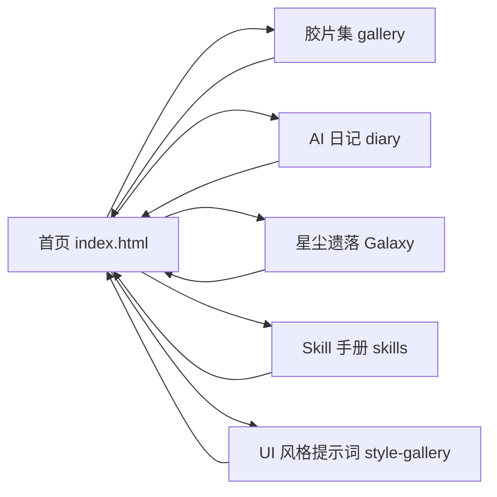

# Lin's Lab 产品需求文档（PRD）— 版本 3

**版本**：v3，基于 PRD-001 的迭代更新  
**产品名称**：Lin's Lab（刘锦麟个人站）  
**基线**：Vercel 部署版本，域名 `gatsby-website-nine.vercel.app`  
**本版修订重点**：首页品牌标题与副标题设计、Skill 手册样式规范、统计与 CDN 容错。

---

## 一、产品概述

### 1.1 产品定位

Lin's Lab 是**个人品牌与实验入口站**：展示项目入口（胶片集、AI 日记、星尘遗落、Skill 手册、UI 风格提示词等），并提供全站可用的「灵感垃圾桶」用于随时记录、沉淀灵感，并在星尘遗落页以可视化方式回顾。

### 1.2 目标用户

- **主用户**：站点主本人（刘锦麟），用于日常记录、作品展示与灵感管理。
- **访客**：通过链接或搜索进入的读者，浏览日记、胶片、星尘与 Skill 手册。

### 1.3 核心价值

- **统一入口**：一个首页聚合所有子项目与实验。
- **灵感不丢**：多页可用的灵感垃圾桶，支持 Supabase 持久化与星尘可视化。
- **轻量可维护**：静态站、无后端服务，构建即部署，便于长期迭代。

---

## 二、产品结构

### 2.1 站点地图



### 2.2 页面清单

| 路径 | 名称 | 说明 |
|------|------|------|
| `/` | 首页 | Lin's Lab 标题 + 副标题「项目与实验入口」+ 入口卡片 + 灵感垃圾桶入口 |
| `/gallery.html` | 胶片集 | 摄影作品瀑布流 + 灯箱 |
| `/diary.html` | AI 日记 | 手写 HTML 日记列表 + 一言格言 + 灵感垃圾桶 |
| `/Galaxy.html` | 星尘遗落 | 灵感星尘 Canvas 可视化 + 搜索/查看/删除 |
| `/skills.html` | Skill 手册 | Cursor Agent Skills 分组列表与调用路径（可复制） |
| `/style-gallery.html` | UI 风格提示词 | 多种 UI 风格小样与一键复制 prompt |

### 2.3 全局能力（多页共有）

- **主题切换**：明/暗模式，持久化在 `localStorage.theme`。
- **灵感垃圾桶**：右下角入口，任意已接入页面可打开并「吞噬」灵感；数据 Supabase 优先，失败回退 localStorage。
- **分析埋点**：GA4 页面浏览；PostHog 行为事件（灵感垃圾桶使用、胶片点击等）。本地开发（localhost/127.0.0.1）不请求统计脚本，避免 404 与控制台报错。

---

## 三、首页品牌与交互（本版重点）

### 3.1 标题「Lin's Lab」

- **文案**：`Lin's` 与 `Lab` 之间**保留一个空格**，并在 **s** 与 **L** 之间加入弧形箭头符号 **↷**（Unicode U+21B7），视觉呈现为「Lin's ↷ Lab」。
- **样式**：标题为**黑色**（亮色主题 `#1a1a2e`，暗色主题 `#e8eef4`），无彩虹渐变。
- **交互**：鼠标悬停在某**字母**上时，该字母单独上移（`transform: translateY(-6px)`），移出后回位；箭头符号不参与悬停上移。
- **实现要点**：标题由脚本拆成逐字 `<span class="linslab-char">`，悬停用 CSS class `.linslab-char--hover`；箭头为独立 `<span class="linslab-arrow">`，字号略小、略上移，继承标题颜色。

### 3.2 副标题「项目与实验入口」

- **样式**：整行使用**彩虹渐变**（红→橙→黄→绿→蓝→紫→粉），暗色主题下为更亮色系同款渐变。
- **光带**：一层从左到右**周期性扫过的光带**（约 4 秒一轮），仅作用于副标题文字形状，无按字悬停故无「扫到某字消失」问题。
- **实现要点**：副标题包在 `.linksb-subtitle-inner`（彩虹）+ `.linksb-subtitle-shine`（光带克隆层），CSS 动画 `linksb-subtitle-sweep` 控制 `background-position`。

### 3.3 首页布局示意（ASCII）

```
+--------------------------------------------------+
|  [主题切换]                                       |
|  +--------------------------------------------+  |
|  |  Lin's ↷ Lab        （黑字，悬停某字母上移）   |  |
|  |  项目与实验入口      （彩虹 + 光带扫过）       |  |
|  +--------------------------------------------+  |
|  [胶片集]  [AI 日记]  [星尘遗落]  [Skill]  [UI风格] |
+--------------------------------------------------+
                                    [灵感垃圾桶] <- 右下角
```

---

## 四、其他页面与功能（与 PRD-001 对齐）

- **胶片集**：`GALLERY_PHOTOS`、小写 `1.jpg`…`10.jpg`、灯箱、PostHog `image_clicked`。
- **AI 日记**：时间正序、最早在上；新增日记在 `diary-section` 最下方追加；一言格言、灵感垃圾桶内联实现。
- **星尘遗落**：Supabase/localStorage 双源、Canvas 星尘、搜索高亮、点击查看/删除。
- **Skill 手册**：分组展示、每项可复制调用路径；样式为独立深色卡片，**无内联 style**，按分组 class（如 `.skill-group-1`）在 CSS 中统一控制颜色与悬停。
- **灵感垃圾桶**：跨页、Supabase 优先、PostHog `idea_bin_used`、吞噬动画与 Esc 关闭。

---

## 五、数据、分析与构建（摘要）

- **Supabase**：表 `inspirations`，RLS 匿名 insert/select；仅 anon key；构建时 `generate-supabase-config.js` 生成 `public/supabase-config.js`。
- **分析**：`analytics-bootstrap.js` 动态拉取 config/loader，本地 host 为 localhost/127.0.0.1 时不请求，避免 404；Supabase 脚本可从 unpkg 加载以减轻追踪拦截。
- **构建命令**：`node scripts/copy-styles.js && node scripts/generate-supabase-config.js && node scripts/generate-analytics-config.js && vite build`
- **部署**：GitHub main 推送触发 Vercel 自动构建；生产域名 `gatsby-website-nine.vercel.app`；改环境变量后需 Redeploy。

---

## 六、文档与版本

- **PRD 编号**：`prd/PRD-003.md`（本文件）；历史版本见 `PRD-001.md`、`PRD-002-ui-style-prompt-gallery.md`。
- **本版修订说明**：
  - 产品名称统一为「Lin's Lab」；标题增加 s 与 L 之间的弧形箭头 ↷ 及空格约定。
  - 首页标题改为黑色 + 单字悬停上移；副标题改为彩虹 + 光带扫过。
  - Skill 手册取消内联样式，改为分组 CSS 类 + 卡片悬停 `:hover`。
  - 统计脚本改为 bootstrap 动态加载，本地不请求；Supabase CDN 可选用 unpkg。
- 后续若改版或变更数据流，应同步更新本文档并注明版本与变更说明。
